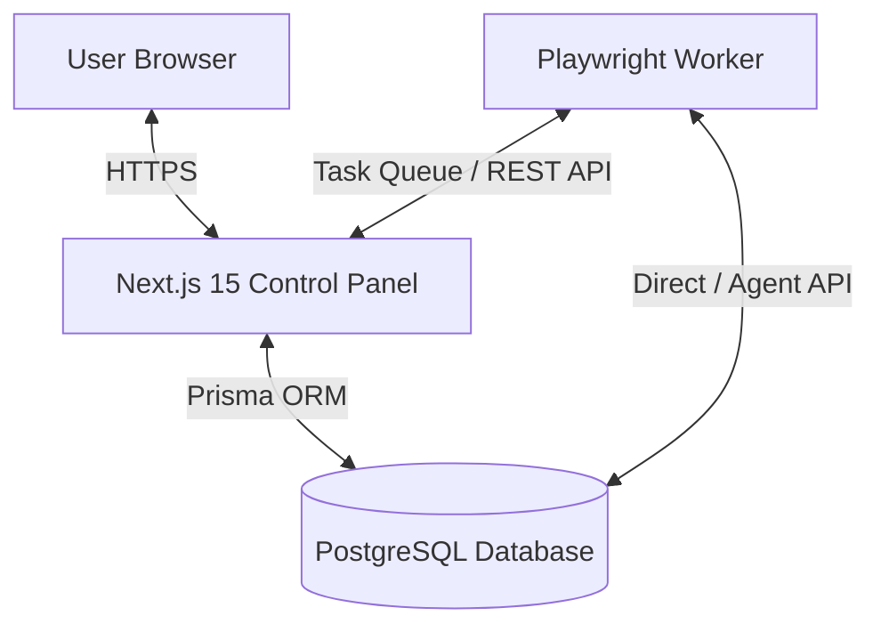

# Project Overview: Facebook Automation & Group Discovery Engine

This project is a high-performance web platform designed to facilitate automated Facebook group discovery, monitoring, and workflow integration. By combining a modern web frontend with a headless automation runner (Playwright), the system enables users to locate niche Facebook communities, track activity, and orchestrate campaigns efficiently while remaining compliant with security best practices.

## Project Goals

- **Efficient Discovery**: Automated discovery of Facebook groups based on keywords, size, activity level, and privacy settings.
- **Activity Monitoring**: Headless tracking of group posts, engagement metrics, and hot topics without manual browsing.
- **Robust Automation Separation**: Complete isolation between the user dashboard/web application and the automation workers (Playwright). This guarantees that scraper resource spikes or crashes do not impact dashboard responsiveness or database integrity.
- **Secure Credentials**: Secure storage of credentials and session states for automation profiles, utilizing advanced encryption.

## Architecture Vision

The platform is designed around a three-tier decoupled architecture:
1. **Frontend / Control Panel**: A Next.js 15 web app presenting a polished, dark-themed control center. Users configure search queries, review discovered groups, manage credentials, and audit logs.
2. **Database Layer**: PostgreSQL managed via Prisma ORM. Stores configurations, sessions, scraper tasks, audit logs, and discovered group lists.
3. **Execution Workers**: Isolated Node.js runners executing Playwright scripts. These workers poll the database for scraping tasks, perform the browser automation tasks on Facebook inside containerized environments, and report results back to the database via secure API endpoints.

## Future Modules

- **Credential Manager**: Multi-profile vault supporting proxy assignment, MFA tokens, and automated cookie refreshment.
- **Group Discovery Engine**: Advanced search heuristics using graph searches and recommendation loops to discover adjacent groups.
- **Analytics & Engagement Dashboard**: Sentiment analysis on group posts and automated trend alerts.
- **Scheduler & Auto-Poster**: Queue-based campaign poster with spin-tax support and anti-detection delays.
