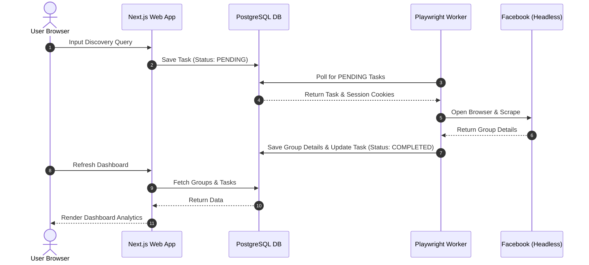

# System Architecture

This document describes the technical flow, components, and data structures of the Facebook Automation & Group Discovery system.

## Frontend & Backend Flow

The frontend is built using Next.js 15 utilizing the App Router. The communication flow between frontend, backend, and external actors is summarized below:

1. **User Interaction**: Users log in to the Next.js control panel, manage settings, and define discovery queries (e.g. keywords, frequency).
2. **State Storage**: Next.js updates PostgreSQL with new search tasks, credentials, and parameters via Prisma.
3. **Queue Ingestion**: An active task queue stores jobs that need execution (e.g. "Scrape Group XYZ" or "Search Keyword 'AI'").
4. **Worker Dispatch**: Playwright workers fetch pending tasks, perform scraping, and submit extracted data back to Next.js or write it directly to the DB.

## Playwright Worker Explanation

Playwright automation is decoupled from the main web server for the following reasons:
- **Resource Management**: Headless browser automation consumes high amounts of CPU and Memory. Isolating workers ensures the Next.js app remains fast and responsive.
- **Anti-Detection & Proxying**: Workers can run in containerized environments (like Docker containers on Railway or AWS ECS) with distinct proxies, mimicking real user behaviors without sharing IP addresses with the main application server.
- **Isolation of Failures**: If a browser crashes, runs out of memory, or gets blocked by Facebook's login gates, only that specific worker task fails. The dashboard and scheduling service remain completely unaffected.
- **Task Protocol**: The worker runs a Node.js daemon that connects to the database via Prisma or communicates through secure REST endpoints using a JWT-based token header.

## Database Explanation

The database uses PostgreSQL as the core storage engine. The application accesses it via **Prisma ORM**.

- **Session and User Security**: Custom session-based auth tracks user identity securely. Sessions are validated on the database level rather than stateless JWTs, enabling instant session revocation.
- **Data Persistence**: Stores discovery tasks, FB profiles (cookies, proxy config), logs, and scraped Facebook group meta-data.
- **Concurrency & Locking**: Scraper tasks are fetched using transactional locks to prevent multiple workers from executing the same scraping run simultaneously.
- **Prisma Client**: A global Prisma client is used throughout the Next.js application, supporting connection pooling via PgBouncer or Supabase/Railway connection strings.
