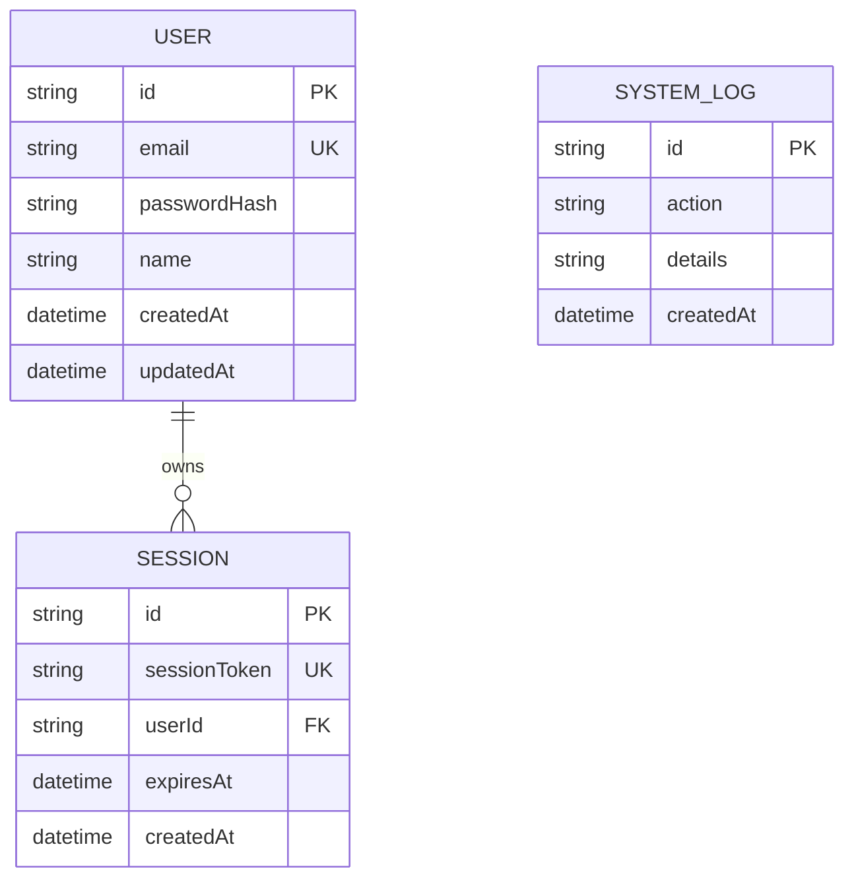

# Database Schema & Data Models

This document outlines the PostgreSQL database schema defined via Prisma ORM for the Facebook Automation and Group Discovery platform.

## Table Schemas

### User Table (`User`)
Stores dashboard operator credentials and account configuration.
- `id` (String, Primary Key): UUID.
- `email` (String, Unique): The user's login email.
- `passwordHash` (String): Hashed password using bcryptjs.
- `name` (String, Optional): The user's display name.
- `createdAt` (DateTime): Timestamp of creation.
- `updatedAt` (DateTime): Timestamp of last modification.

### Session Table (`Session`)
Stores active dashboard login sessions for authentication persistence.
- `id` (String, Primary Key): UUID.
- `sessionToken` (String, Unique): Cryptographically secure random token set in the client's cookies.
- `userId` (String, Foreign Key): Links to `User.id`.
- `expiresAt` (DateTime): Expiration timestamp for session validation.
- `createdAt` (DateTime): Timestamp of login.

### SystemLog Table (`SystemLog`)
Audit log for system activity (e.g. Scraper starts, auth actions, database health).
- `id` (String, Primary Key): UUID.
- `action` (String): Action category (e.g., `"USER_LOGIN"`, `"SCRAPER_STARTED"`, `"DB_ERROR"`).
- `details` (String): Detailed text describing the log entry.
- `createdAt` (DateTime): Creation timestamp.

---

## Entity Relationships

- **User & Session (One-to-Many)**: A `User` can have multiple active `Session` records (enabling logins across different browsers/devices). When a `User` is deleted, their associated `Session` records are deleted (cascade delete).

---

## Future Expansions

To implement the Playwright task queues and group discovery results, the schema will be expanded with the following models:

### 1. FacebookProfile (`FacebookProfile`)
Stores automation credentials and session state.
- `id` (UUID)
- `username` (String)
- `cookiesJson` (Text): Saved Facebook authentication state to bypass login checks on worker startup.
- `status` (Enum: `"ACTIVE"`, `"FLAGGED"`, `"LOCKED"`)
- `proxyUrl` (String, Optional)

### 2. DiscoveryTask (`DiscoveryTask`)
Queue jobs for the Playwright scraper.
- `id` (UUID)
- `keyword` (String)
- `status` (Enum: `"PENDING"`, `"RUNNING"`, `"COMPLETED"`, `"FAILED"`)
- `workerId` (String, Optional)
- `createdAt` / `updatedAt`

### 3. DiscoveredGroup (`DiscoveredGroup`)
Scraped data representing discovered Facebook Groups.
- `id` (String, Primary Key): The Facebook Group ID.
- `name` (String)
- `url` (String)
- `memberCount` (Int)
- `privacy` (String): `"PUBLIC"` or `"PRIVATE"`
- `activityLevel` (String): e.g. "10 posts per day"
- `taskId` (UUID, Foreign Key): Links back to the `DiscoveryTask` that found this group.
