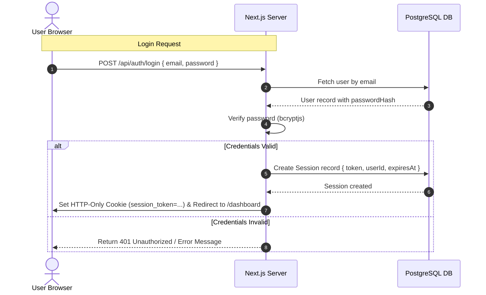

# Authentication Architecture

This document details the custom database-backed session authentication system designed for the Facebook Discovery dashboard.

## Auth Flow

The login system uses secure HTTP-only cookies combined with database session records. This ensures that session hijacking risks are minimized, and administrators can immediately invalidate active user sessions from the backend.

## JWT / Session Handling

Instead of using stateless JSON Web Tokens (JWTs), the platform utilizes **Database-backed Sessions**. Here is a comparison of why this choice was made:

| Attribute | Stateless JWTs | Database-Backed Sessions (Ours) |
| :--- | :--- | :--- |
| **Revocation** | Difficult. Must wait for expiration or maintain a blacklist. | Instant. Deleting the session record immediately logs the user out. |
| **Payload Size** | Larger. Encodes user roles, metadata, and signatures in the cookie. | Small. Contains only a random UUID session token. |
| **Database Load** | Low. Doesn't hit database on verification. | Medium. Checks database for session validity. (Optimized via indexes). |
| **Security** | If compromised, active until token expires. | Single point of revocation. Easy to audit active sessions. |

### Session Token Specs
- **Storage**: Set in an `HTTP-Only`, `Secure`, `SameSite=Lax` cookie named `session_token`.
- **Encryption**: The token is a secure random string (UUID or 32-byte hex).
- **Life Span**: Session duration is set to 7 days by default, refreshed on active user interaction.

## Protected Routes

Route protection is managed at two layers:
1. **Next.js Middleware (`src/middleware.ts`)**:
   - Intercepts requests to `/dashboard/:path*`.
   - Reads the `session_token` cookie.
   - Decodes or validates the token structurally. If missing, it immediately redirects to `/login`.
   - *Note*: Database lookups inside Next.js Edge Middleware are avoided to minimize latency. The database check is performed in the layout or server actions.
2. **Server Layout Verification (`src/app/dashboard/layout.tsx`)**:
   - The Root Layout of the dashboard fetches the session from the database using `prisma.session.findUnique`.
   - If the session is missing, invalid, or expired, it deletes the cookie and redirects the user to `/login`.
   - If valid, the current user details are injected into the server rendering context, ensuring secure data rendering.

### Route Map

- `/` - Public landing homepage.
- `/login` - Public login page. Redirects to `/dashboard` if user is already authenticated.
- `/signup` - Public registration page. Redirects to `/dashboard` if user is already authenticated.
- `/dashboard` - Protected dashboard shell. Requires valid session.
- `/dashboard/settings` - Protected settings page. Requires valid session.
