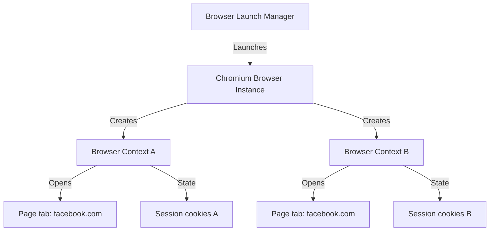

# Playwright Scraper Engine

This document details the architecture, anti-detection (stealth) configurations, and cookie persistence mechanisms built into the Playwright automation subsystem.

## Playwright Architecture

Playwright interacts with Chromium, Firefox, and WebKit browsers using a direct connection protocol (via WebSockets or Chrome DevTools Protocol), which makes it faster and less prone to detection than Selenium (which uses WebDriver HTTP protocols).

The engine is structured as follows:
1. **Browser Instance**: A single browser process launched by the manager.
2. **Browser Context**: An isolated "incognito" session within the browser instance. Each context maintains its own cookies, localStorage, cache, and viewport settings.
3. **Page**: A single tab inside a Browser Context.



By using distinct **Browser Contexts**, the platform can execute multiple scraping threads under different Facebook profiles concurrently, without cross-contamination of sessions.

## Stealth Strategies

Facebook uses advanced bot-detection systems (like Akamai, perimeter security, and fingerprinting). To minimize detection and avoid account verification checkpoints, the launcher implements these stealth overrides:

### 1. Webdriver Flag Spoofing
Most detection scripts check the value of `navigator.webdriver`. By default, automated browsers set this to `true`. We override this flag on the page window using script injection before document load.
```typescript
await page.addInitScript(() => {
  Object.defineProperty(navigator, 'webdriver', {
    get: () => false,
  });
});
```

### 2. User-Agent & Platform Matching
We use realistic, modern desktop User-Agents and match them with appropriate `navigator.platform` and hardware concurrency levels:
- **User-Agent**: `Mozilla/5.0 (Windows NT 10.0; Win64; x64) AppleWebKit/537.36 (KHTML, like Gecko) Chrome/120.0.0.0 Safari/537.36`
- **Platform**: `Win32`

### 3. Disabling Automation Indicators
We pass custom command-line arguments to Chromium to disable infobars and prevent blink flags from exposing automation hooks:
- `--disable-blink-features=AutomationControlled`
- `--disable-infobars`

### 4. Human-like Interactions (Delay and Jitter)
Scrapers avoid instantaneous clicks and keystrokes. Interactions are padded with randomized delays (e.g., waiting 100ms - 300ms between key taps) and smooth scrolls to mimic natural mouse scrolling behaviors.

## Session Persistence

Logging in to Facebook repeatedly is the fastest way to get an account banned. To avoid this, we capture the authentication state once and reuse it across multiple scraping runs.

### Storage State Mechanics
Playwright provides the `context.storageState()` API. This retrieves:
- All cookies (including Facebook authentication tokens like `c_user`, `xs`, and `fr`).
- All `localStorage` keys and values.

We save this payload as a JSON file in `automation/cookies/<profile_id>.json`.

### Lifecycle Flow:
1. **Login Trigger**: The launch manager starts a browser context, navigates to `https://www.facebook.com`, and waits for the user to log in or automates credentials entry.
2. **State Capture**: Once the home feed loads, `context.storageState({ path: 'automation/cookies/<profile_id>.json' })` is executed, saving the state.
3. **State Recovery**: On subsequent scraping tasks, the launcher initializes the context using the saved state:
   ```typescript
   const context = await browser.newContext({
     storageState: 'automation/cookies/<profile_id>.json',
   });
   ```
   This immediately logs the browser page back into Facebook without hitting the credential submission forms.
