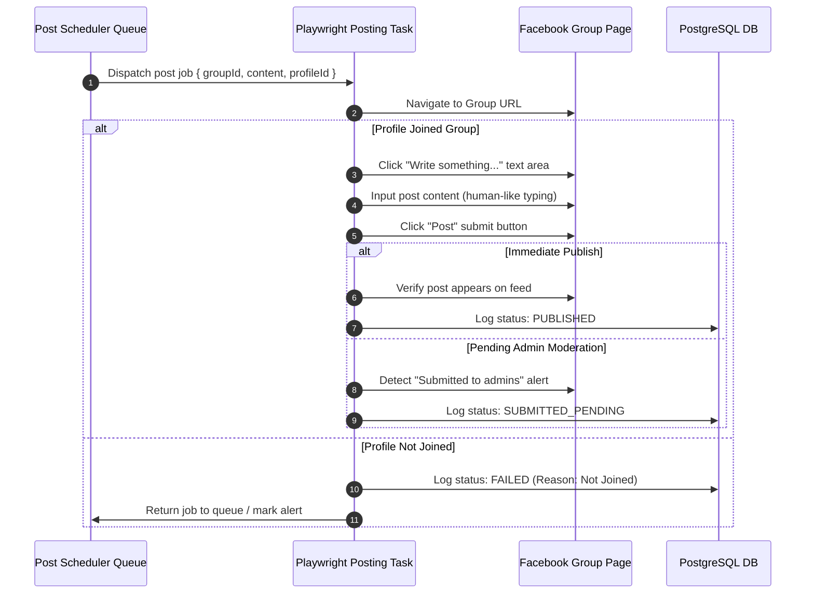

# Posting Engine Architecture

This document outlines the execution workflow, rate-limiting policies, and anti-detection strategies built into the automated group posting subsystem.

## Posting Flow

Publishing content automatically inside Facebook groups follows a strict execution pipeline to verify membership and ensure post delivery:

## Rate Limits

Facebook aggressively monitors account posting patterns. Exceeding daily thresholds or posting too rapidly triggers account locks, posting bans, or captcha challenges. The following posting limits are enforced:

### 1. Daily Volume Caps
- **New Accounts (Warming phase)**: Maximum of **3 posts per day**.
- **Warmed Accounts (1-3 months old)**: Maximum of **8-12 posts per day**.
- **Established Accounts**: Maximum of **15-20 posts per day**.

### 2. Temporal Spacing
- Posts must not be published consecutively. Introduce a spacer of **at least 30 to 45 minutes** between group postings.
- Run posting queues only during realistic local timezone hours (e.g. 8:00 AM to 9:00 PM).

### 3. Post Content Spin-tax
- Posting the exact same message body across multiple groups triggers Facebook spam detection immediately.
- The posting runner must support content variations using Spin-tax template formats:
  - *Format*: `"{Hello|Hi|Hey} there! Check out {this tech|our product}."`
  - *Resolver*: Randomly picks one variation per post, generating distinct body contents for each target group.

## Anti-Detection Strategies

To bypass Facebook's automated behavior detectors during posting runs, the posting engine implements these defenses:

- **Stealth Browser Handlers**: Reuses the launch configuration in `automation/browser.ts` to spoof User-Agents, mask `navigator.webdriver = false`, and fake language parameters.
- **Randomized Typing Jitter**: Instead of pasting text instantly, the runner simulates human typing. It splits the message string into characters and inputs them with random keystroke delays (e.g., between 40ms and 150ms per key tap).
- **Behavioral Padding**: The runner performs simulated human routines before submitting the post:
  - Move mouse coordinates randomly.
  - Hover over buttons for 200ms - 500ms before clicking.
  - Wait 2-3 seconds after typing the message before clicking "Submit" to emulate a user proofreading their post.
- **Dynamic CSS Parsing**: Avoids hardcoded class selectors. The engine locates input fields using semantic roles (e.g. `[role="textbox"]`, `[aria-label*="Create a public post"]`, `[aria-label*="Write something"]`).
