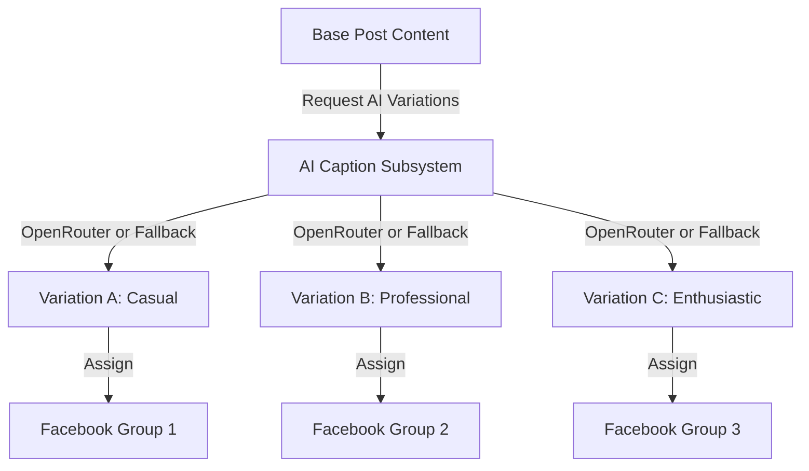

# AI Caption System

This document outlines the architecture, OpenRouter configurations, prompt systems, and variation logic of the AI Caption System.

## OpenRouter Integration

To generate natural and distinct post Captions, the system integrates with **OpenRouter**, a unified API gateway for Large Language Models (LLMs). This provides the following benefits:
- **Model Flexibility**: Easily swap between free or lightweight models (e.g. `meta-llama/llama-3-8b-instruct:free`, `google/gemini-flash-1.5`) depending on rate limits and speed needs.
- **Unified Headers**: Standard HTTP calls to `https://openrouter.ai/api/v1/chat/completions` using an `OPENROUTER_API_KEY` without loading model-specific heavy packages.
- **Fail-safe Fallbacks**: If the API key is not present, or if the network connection drops, the integration triggers a **Local Spin-tax template rewriter** (randomly injecting synonym-rich prefixes/suffixes) ensuring offline operations remain uninterrupted.

## Prompt Structure

To bypass Akamai/Facebook spam filters, the generated post captions must have completely different structures, sentence orders, and vocabularies. The prompt is designed to enforce this:

1. **System Prompt (Instructions)**:
   - Establish role: "Expert social media optimizer bypassing duplicate text filters."
   - Explicit constraints: "Rewrite vocabulary and sentence order. Include emojis or line breaks dynamically to ensure structural divergence."
   - Format: Forces the LLM to reply with a raw, parseable JSON block, avoiding markdown wrapper elements.
2. **User Prompt (Task)**:
   - Feeds the original text block and requests `count` unique variations (typically 3).
   - Demarcates input content using double quotes to prevent prompt injection attempts.

```
You are an AI assistant helping a community manager rewrite Facebook group posts. 
Generate unique variations that convey the same message but bypass copy-paste duplicate text detectors.
Vary the vocabulary, sentence order, and formatting (e.g. emojis or line breaks).
Your response MUST be a valid JSON object. Do not include markdown code block formatting.
Format:
{
  "variations": [
    { "tone": "Professional", "caption": "..." },
    { "tone": "Casual", "caption": "..." },
    { "tone": "Enthusiastic", "caption": "..." }
  ]
}
```

## Variation Logic (Anti-Duplicate System)

The posting runner enforces a strict "anti-duplicate" scheduling checklist. When posting the same underlying update to multiple groups, the system executes this pipeline:

1. **Generation Trigger**: The operator writes a base post.
2. **Variation Fetch**: The system retrieves three unique variations:
   - **Professional**: Authoritative, informative tone.
   - **Casual**: Chatty, community-friendly tone.
   - **Enthusiastic**: High engagement, emoji-rich tone.
3. **Queue Assignment**: Each group in the campaign is assigned a distinct variation, ensuring no two groups receive the same text string consecutively.


